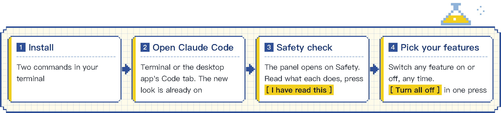

<div align="center">

# lemo-mod

**English** · [**简体中文**](README.zh-CN.md)

**Re-skin Claude Code in one click, with a full set of features you turn on when you need them.**<br>
**21 styles for the terminal and the desktop app.**<br>
**一键为 Claude Code 换上新风格，并提供一整套按需开启的功能。**<br>
**21 套风格，终端和桌面 App 都能用。**


[**▶ See every style · 看全部风格**](https://lemomo-ai.github.io/lemo-mod/)

</div>

## What is lemo-mod · lemo-mod 是什么

lemo-mod is a set of style mods built on Claude Code's official mod interface. Once installed, Claude Code in the terminal and in the desktop app's Code tab can switch styles in one click. Colors, pixel mascot, spinner words, sounds and names all change together.

Beyond looks, lemo-mod provides a full set of features, including a four-page panel, a usage band, a status line, message numbers and reply tags, sounds, speech, brief mode, reminders, a focus timer, notes, session recaps, per-turn stats, a time limit, a log, auto tags, a lot-drawing tool and a read-only assistant. Your settings are only read, never changed, and every feature beyond looks is yours to turn on.

> [!NOTE]
> **中文读者请看这里。** lemo-mod 是一组基于 Claude Code 官方 mod 接口的风格化 mod。装上之后，终端里的 Claude Code 和桌面 App 的 Code 标签都能一键换风格，配色、像素小画、加载词、音效和名字一起换。
>
> 除了外观，lemo-mod 还提供一整套功能，包括四页面板、用量横条、状态栏、消息编号和回复标签、音效、朗读、简短模式、定时提醒、番茄钟、笔记、会话小结、每轮统计、限时、日志、自动分类、抽签工具和一个只读助手。你的设置只读不改，外观以外的功能都由你自己开启。
>
> **→ [阅读中文版 README](README.zh-CN.md)**

## What you get

<p align="center"></p>

**Looks are on from the start.** Your messages get numbers like `T01` and `T02`, and each of Claude's replies shows which one it answers. Tool rows, turn lines and spinner words take on the style. A band above the prompt shows context, the 5-hour quota, cost and git branch, with a status line below it. Claude's question dialog gets a header. Type `/lemo-mod` to open the panel, with four pages: Main, Behavior, Background and Safety.

**The first time you open it, the panel starts on the Safety page.** Read what each feature does, turn on the ones you want, and press **I have read this**. You can switch any feature on or off on the Safety page at any time. **Turn all off** stops everything but looks in one press. The numbering note and the lot tool are fully gone from the next session.

<table>
<tr>
<td><b>Sounds</b><br>Style sounds on tool calls and turn ends<br><sub>switch · sound</sub></td>
<td><b>Speech</b><br>Reads out the message number and time when a long task ends<br><sub>switch · speech</sub></td>
<td><b>Brief mode</b><br>Answers in three sentences or fewer<br><sub>switch · adds to prompt</sub></td>
<td><b>Notebook voice</b><br>Opens with what it looked at and ends with a conclusion<br><sub>switch · adds to prompt</sub></td>
</tr>
<tr>
<td><b>Time limit</b><br>Stops a turn that runs over time<br><sub>switch · acts for you</sub></td>
<td><b>Log</b><br>One line per turn in <code>~/.claude/lemo-mod/journal.md</code><br><sub>switch · writes a file</sub></td>
<td><b>Auto tags</b><br>Tags each message as question, code, debug or chat<br><sub>switch · extra usage · message start goes to a small model</sub></td>
<td><b>Auto summary after compaction</b><br>Saves a one-line note after each compaction<br><sub>switch · extra usage · summary goes to a small model</sub></td>
</tr>
<tr>
<td><b>Lot tool</b><br>Say "draw a lot" and Claude draws one<br><sub>switch · adds a tool</sub></td>
<td><b>Numbering note</b><br>Tells Claude what <code>T03</code> refers to<br><sub>switch · adds to prompt</sub></td>
<td><b>Claude can send the assistant</b><br>Lets Claude send the read-only assistant<br><sub>switch · extra usage · report joins the chat</sub></td>
<td><b>Session recap</b><br>Sums up this session in three lines<br><sub>on demand · main model reads the chat</sub></td>
</tr>
<tr>
<td><b>Reminder</b><br>Asks Claude for a progress update after N seconds<br><sub>on demand</sub></td>
<td><b>Focus timer</b><br>A countdown on the band and a reminder when time is up<br><sub>on demand</sub></td>
<td><b>Write a report</b><br>The read-only assistant writes a three-line report<br><sub>on demand · report joins the chat</sub></td>
<td><b>Check for updates</b><br>The only one that visits an outside website<br><sub>on demand</sub></td>
</tr>
</table>

<sub><b>switch</b> Off at install. Turn it on or off on the Safety page at any time. <b>on demand</b> Runs only when you press its button or type its command.</sub>

## Safety

A mod runs with your permissions, so it matters whose mods you install. lemo-mod follows these rules. See [SAFETY.md](SAFETY.md) for details.

1. **No permission decisions for you.** No mod allows or blocks a tool call. Your own settings and permission mode decide.
2. **Your settings are read, never changed.** Only the few that overlap with the mods are read, on your machine. They are not stored and not sent to Claude.
3. **Only looks are on at install.** Everything else starts off.
4. **Every automatic feature has a switch on the Safety page.** On-demand features run only when you press a button or type a command. Type `/lemo-mod safety` to open the page.
5. **Where your setup overlaps, yours wins.** If you set your own status line or spinner words, yours stay, and the Safety page says why.

To check before you install, clone this repo and run `claude plugin validate plugins/<mod>`. The `hooks:` and `calls:` lines in its output list the events each mod handles and what it asks Claude Code to do.

## Install

You need Claude Code v2.1.287 or later. Check with `claude --version`. In your terminal, run:

```sh
claude plugin marketplace add lemomo-ai/lemo-mod
claude plugin install lemo-mod@lemo-mod
```

Then restart Claude Code, in the terminal or in the desktop app's Code tab. The panel starts on the Safety page. Preview the sounds and the voice if you like, turn on what you want, and press **I have read this**. In a terminal narrower than 144 columns, type `/lemo-mod safety` to open it. After that, each new session lists what is on in the band, so nothing runs quietly.

`lemo-mod` installs all 16 mods, and each one is its own plugin. To drop one look or feature, turn it off on the Safety page. To turn a whole mod off, first turn off the `lemo-mod` bundle, then the mod. The bundle is only a list, so turning it off leaves every mod on. Do this in `/plugin` in that order, or run:

```sh
claude plugin disable lemo-mod@lemo-mod
claude plugin disable lemo-spinner@lemo-mod
```

Turning the bundle back on turns all 16 mods on again.

For the best look, match Claude Code's theme to your terminal's light or dark background, for example a dark theme on a dark terminal. Set the theme with `/theme`. In the desktop app, light mode looks best.

## Use

| Type | Does |
|---|---|
| `/lemo-mod` | Open the panel |
| `/lemo-mod safety` | Open the Safety page, and the same for `main`, `behavior` and `background` |
| `/lemo-mod style <name>` | Switch style, or list all styles with no name |
| `/lemo-mod name <name>` | Name the current style, or restore its name with no name |
| `/lemo-mod mute` or `sound` | Turn sound off or on |
| `/lemo-mod speak` | Hear a speech preview |
| `/lemo-mod brief` | Turn brief mode on or off |
| `/lemo-mod focus 25` | Start a 25-minute focus timer |
| `/lemo-mod remind 30` | Ask Claude for a progress update in 30 seconds |
| `/lemo-mod recap` | Get a three-line session recap |

In the terminal, press `ctrl+x Tab` to move into the panel, `a` to `d` to switch pages, number keys to press the buttons on the cards, and `Esc` to go back to the prompt. The interface follows the language of your latest message, Chinese or English.

## Styles

There are 21 styles. 20 themed styles each have their own colors, pixel mascot, spinner words, sounds and names. Plain has no mascot and uses the default sounds.

Lemo Lab · Lucky Koi · Cassie · Peeky · Sprouty · Chubby Bun · Choo-Choo · Masky · Pixel Pal · Zoomy · Campfire · Mango Pop · Postie · Magic Gourd · Clacky · Waddles · Bubbles · Lanny · Blinky · Tri-Tri · Plain

[See each style in the terminal and the desktop app, light and dark](https://lemomo-ai.github.io/lemo-mod/)

## Where it works

| Where | What you see |
|---|---|
| `claude` in a terminal | Everything |
| Desktop app, Code tab | Everything the app can draw, the rest is hidden |
| VS Code chat panel and `claude -p` | No interface |

Features you turn on still work in VS Code and `claude -p`, just without the interface.

In the desktop app's auto mode, the panel's **Write a report** button is stopped by the auto mode check, which cannot see that you pressed it. Turn on **Claude can send the assistant** (on the Safety page or the assistant card), then ask Claude to send the assistant to write a three-line report; or switch to another permission mode and press it again.

Your style, switches and safety confirmation are saved once for all projects and sessions, and shared by the terminal and the desktop app. If you add the marketplace from a local folder or load the plugins with `--plugin-dir`, the desktop app keeps its own copy, so you confirm once on each side.

## Update

Updating the `lemo-mod` bundle does not update the mods inside it, so update each one. Then restart Claude Code or type `/reload-plugins` in an open session.

```sh
claude plugin marketplace update lemo-mod
for m in lemo-mod lemo-core lemo-skin lemo-spinner lemo-ask lemo-meter lemo-guard lemo-sound lemo-voice lemo-tone lemo-pomodoro lemo-watch lemo-recap lemo-todo lemo-journal lemo-lot lemo-assistant; do
  claude plugin update "$m@lemo-mod"
done
```

## Uninstall

```sh
claude plugin uninstall lemo-mod@lemo-mod
claude plugin prune
claude plugin marketplace remove lemo-mod
```

Your switches and notes are saved in `~/.claude/plugins/store/lemo-*`. If you turned on the log, it is in `~/.claude/lemo-mod/`. Delete them too to remove everything.

## The mods

| Mod | What it does |
|---|---|
| `lemo-core` | Styles, language, message numbers, the `/lemo-mod` panel and its Safety page |
| `lemo-skin` | Message numbers, reply tags, and tool rows and turn lines in the style |
| `lemo-spinner` | Spinner words from the style, with the message number |
| `lemo-ask` | Message number and question count above the question dialog |
| `lemo-meter` | The usage band, the status line, git branch and update check |
| `lemo-sound` | Sounds on tool calls, turn ends and time-limit stops |
| `lemo-voice` | Reads out the message number and time when a long task ends |
| `lemo-tone` | Brief mode and notebook voice |
| `lemo-guard` | Time limit that stops a turn running over time |
| `lemo-pomodoro` | Focus timer |
| `lemo-watch` | Reminder that asks Claude for a progress update after N seconds |
| `lemo-recap` | Three-line session recap |
| `lemo-todo` | Notes in the panel, with an auto summary after compaction |
| `lemo-journal` | Per-turn stats, log and auto tags |
| `lemo-lot` | A lot-drawing tool for Claude and fortune cards |
| `lemo-assistant` | A read-only assistant that writes a three-line report |

## Coming next

Coming next are combined features, games in the panel and more styles. Ideas for styles or mods are welcome in [Issues](https://github.com/lemomo-ai/lemo-mod/issues).

## About

Made by [lemomo](https://github.com/lemomo-ai) of Lemo Lab, together with Claude. MIT License.
