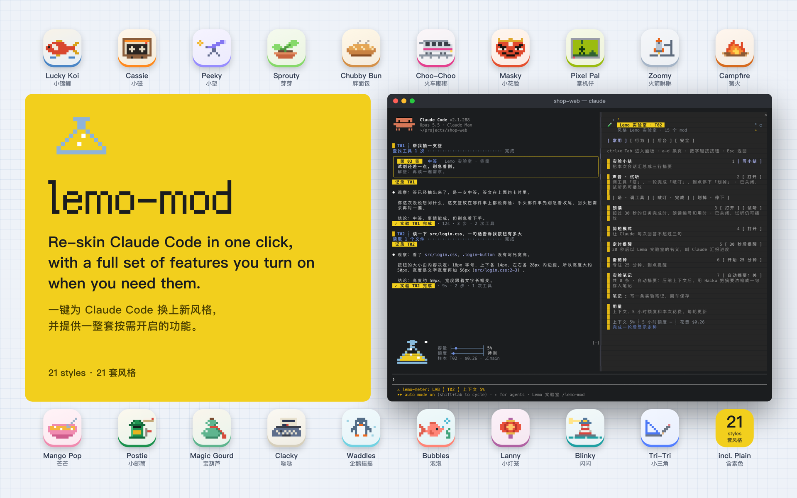
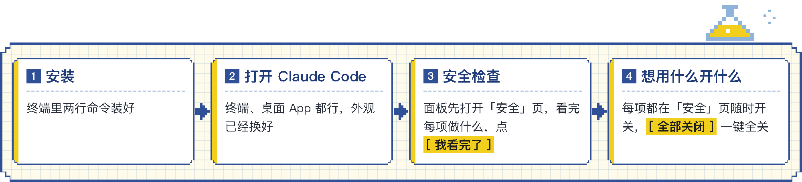

<div align="center">

# lemo-mod

[**English**](README.md) · **简体中文**

**一键为 Claude Code 换上新风格，并提供一整套按需开启的功能。**<br>
**21 套风格，终端和桌面 App 都能用。**



[**▶ 看全部风格**](https://lemomo-ai.github.io/lemo-mod/)

</div>

## lemo-mod 是什么

lemo-mod 是一组基于 Claude Code 官方 mod 接口的风格化 mod。装上之后，终端里的 Claude Code 和桌面 App 的 Code 标签都能一键换风格，配色、像素小画、加载词、音效和名字一起换。

除了外观，lemo-mod 还提供一整套功能，包括四页面板、用量横条、状态栏、消息编号和回复标签、音效、朗读、简短模式、定时提醒、番茄钟、笔记、会话小结、每轮统计、限时、日志、自动分类、抽签工具和一个只读助手。你的设置只读不改，外观以外的功能都由你自己开启。

## 装上以后

<p align="center"></p>

**外观装上即生效。** 你的每条消息带上 `T01`、`T02` 这样的编号，Claude 的回复会标明对应哪一条。工具行、耗时行和加载词换成风格样式。输入框上方的横条显示上下文、5 小时额度、花费和 git 分支，下方是状态栏。Claude 的提问弹窗加上标题。输入 `/lemo-mod` 打开面板，共四页，分别是常用、行为、后台和安全。

**第一次打开时，面板先显示安全页。** 看完每个功能的说明，打开想用的，再点「我看完了」。之后随时可以在安全页开关任何一项。点「全部关闭」会一次关掉外观以外的所有功能，其中编号说明和抽签工具要到下一个会话才完全消失。

<table>
<tr>
<td><b>提示音</b><br>调用工具和一轮结束时播放风格音效<br><sub>开关 · 音效</sub></td>
<td><b>朗读</b><br>长任务结束时朗读编号和用时<br><sub>开关 · 朗读</sub></td>
<td><b>简短模式</b><br>每次回答不超过三句<br><sub>开关 · 附加提示</sub></td>
<td><b>记录口吻</b><br>首行说明看了什么，末行给出结论<br><sub>开关 · 附加提示</sub></td>
</tr>
<tr>
<td><b>限时</b><br>单轮工作超时自动中止<br><sub>开关 · 代你操作</sub></td>
<td><b>日志</b><br>每轮一行，写进 <code>~/.claude/lemo-mod/journal.md</code><br><sub>开关 · 写文件</sub></td>
<td><b>自动分类</b><br>给每条消息标上提问、改代码、排查或闲聊<br><sub>开关 · 额外用量 · 消息开头发给小模型</sub></td>
<td><b>压缩后自动摘要</b><br>压缩上下文后存一句笔记<br><sub>开关 · 额外用量 · 压缩摘要发给小模型</sub></td>
</tr>
<tr>
<td><b>抽签工具</b><br>说一句「抽支签」，Claude 就抽一支<br><sub>开关 · 新增工具</sub></td>
<td><b>编号说明</b><br>告诉 Claude <code>T03</code> 指的是哪一条<br><sub>开关 · 附加提示</sub></td>
<td><b>Claude 可派助手</b><br>允许 Claude 自己派只读助手<br><sub>开关 · 额外用量 · 报告进入对话</sub></td>
<td><b>会话小结</b><br>把本次会话汇总成三行摘要<br><sub>手动触发 · 主模型读整段对话</sub></td>
</tr>
<tr>
<td><b>定时提醒</b><br>N 秒后请 Claude 汇报进度<br><sub>手动触发</sub></td>
<td><b>番茄钟</b><br>横条上倒计时，到点提醒<br><sub>手动触发</sub></td>
<td><b>派助手写周报</b><br>只读助手写三行周报<br><sub>手动触发 · 报告进入对话</sub></td>
<td><b>检查新版本</b><br>唯一访问外部网站的一项<br><sub>手动触发</sub></td>
</tr>
</table>

<sub><b>开关</b> 装上时关着，可在安全页随时开关。<b>手动触发</b> 只在你点按钮或输入命令时运行。</sub>

## 安全

mod 以你的权限运行，所以选择可信的 mod 很重要。lemo-mod 遵循以下原则，详见 [SAFETY.md](SAFETY.md)。

1. **不替你做权限决定。** 任何工具调用都不由 mod 放行或拦截，全按你自己的设置和权限模式。
2. **你的设置只读不改。** 只读取和 mod 重叠的几项，只在本机读取，不保存，也不发给 Claude。
3. **装上时只开外观。** 其他功能默认关闭。
4. **自动功能都在安全页有开关。** 手动功能只在你点按钮或输入命令时运行。输入 `/lemo-mod 安全` 打开安全页。
5. **和你的配置重叠时，以你的为准。** 比如你设置了自己的状态栏或加载词，就继续用你的，安全页会写明原因。

想在安装前自己检查，可以克隆本仓库并运行 `claude plugin validate plugins/<mod>`。输出中的 `hooks:` 和 `calls:` 两行列出每个 mod 接管哪些事件、请 Claude Code 做哪些事。

## 安装

需要 Claude Code v2.1.287 或更高版本，可用 `claude --version` 查看。在终端运行：

```sh
claude plugin marketplace add lemomo-ai/lemo-mod
claude plugin install lemo-mod@lemo-mod
```

装好后重开 Claude Code，终端或桌面 App 的 Code 标签都可以。面板会先显示安全页，你可以试听音效和朗读，打开想用的功能，再点「我看完了」。终端宽度不足 144 列时，输入 `/lemo-mod 安全` 打开。之后每开一个新会话，横条上都会列出已开启的功能，不会有功能悄悄运行。

`lemo-mod` 会装上全部 16 个 mod，每个 mod 都是独立插件。不想要哪处外观或哪个功能，在安全页关掉就行。想把某个 mod 整个关掉，要先关掉合集 `lemo-mod`，再关那个 mod。合集只是一份清单，关掉它不影响任何 mod。在 `/plugin` 里按这个顺序操作，或者运行：

```sh
claude plugin disable lemo-mod@lemo-mod
claude plugin disable lemo-spinner@lemo-mod
```

重新打开合集，16 个 mod 会一起打开。

想要最好的效果，请让 Claude Code 的主题和终端本身的明暗保持一致，比如黑底终端配深色主题。主题用 `/theme` 设置。桌面 App 用浅色模式效果最好。

## 使用

| 输入 | 作用 |
|---|---|
| `/lemo-mod` | 打开面板 |
| `/lemo-mod 安全` | 打开安全页，`常用`、`行为`、`后台` 同理 |
| `/lemo-mod 风格 <名字>` | 换风格，不带名字时列出全部 |
| `/lemo-mod 起名 <名字>` | 给当前风格起名，不带名字时恢复原名 |
| `/lemo-mod 静音` 或 `声音` | 关闭或打开声音 |
| `/lemo-mod 朗读` | 试听朗读 |
| `/lemo-mod 简短` | 开关简短模式 |
| `/lemo-mod 番茄 25` | 开始 25 分钟番茄钟 |
| `/lemo-mod 提醒 30` | 30 秒后请 Claude 汇报进度 |
| `/lemo-mod 总结` | 生成三行会话小结 |

在终端里按 `ctrl+x Tab` 进入面板，`a` 到 `d` 切换页面，数字键按卡片上的按钮，`Esc` 回到输入框。界面语言跟随你最近一条消息，中文或英文。

## 风格

共 21 套风格。其中 20 套主题风格各有自己的配色、像素小画、加载词、音效和名字，另有一套素色，没有小画，音效沿用默认。

Lemo 实验室 · 小锦鲤 · 小磁 · 小望 · 芽芽 · 胖面包 · 火车嘟嘟 · 小花脸 · 掌机仔 · 火箭咻咻 · 篝火 · 芒芒 · 小邮筒 · 宝葫芦 · 哒哒 · 企鹅摇摇 · 泡泡 · 小灯笼 · 闪闪 · 小三角 · 素色

[查看每套风格在终端和桌面 App 里的浅色与深色效果](https://lemomo-ai.github.io/lemo-mod/)

## 在哪能用

| 在哪 | 能看到什么 |
|---|---|
| 终端里的 `claude` | 全部 |
| 桌面 App 的 Code 标签 | App 无法显示的部分会隐藏，其余全部可见 |
| VS Code 聊天面板和 `claude -p` | 不显示界面 |

你开启的功能在 VS Code 和 `claude -p` 里同样生效，只是没有界面。

桌面 App 用自动模式时，面板上的「派助手写周报」会被自动模式的审核拦下，因为审核看不到你按了按钮。可以先打开「Claude 可派助手」（「安全」页或助手卡片上都能开），再直接对 Claude 说「派助手写三行周报」；或换成其他权限模式再按。

风格、开关和安全确认只保存一份，所有项目和会话通用，终端和桌面 App 共用。如果从本地文件夹添加 marketplace 或用 `--plugin-dir` 加载，桌面 App 会单独保存一份，需要在两边各确认一次。

## 更新

只更新 `lemo-mod` 合集不会更新其中的 mod，需要逐个更新。更新后重开 Claude Code，或在已打开的会话里输入 `/reload-plugins`。

```sh
claude plugin marketplace update lemo-mod
for m in lemo-mod lemo-core lemo-skin lemo-spinner lemo-ask lemo-meter lemo-guard lemo-sound lemo-voice lemo-tone lemo-pomodoro lemo-watch lemo-recap lemo-todo lemo-journal lemo-lot lemo-assistant; do
  claude plugin update "$m@lemo-mod"
done
```

## 卸载

```sh
claude plugin uninstall lemo-mod@lemo-mod
claude plugin prune
claude plugin marketplace remove lemo-mod
```

开关和笔记保存在 `~/.claude/plugins/store/lemo-*`。开启过日志的话，日志在 `~/.claude/lemo-mod/`。想彻底清除，就把它们一起删掉。

## 每个 mod

| Mod | 做什么 |
|---|---|
| `lemo-core` | 风格、语言、消息编号、`/lemo-mod` 面板和安全页 |
| `lemo-skin` | 消息编号、回复标注，以及风格化的工具行和耗时行 |
| `lemo-spinner` | 风格化的加载词，附带消息编号 |
| `lemo-ask` | 在提问弹窗顶部显示消息编号和问题数 |
| `lemo-meter` | 用量横条、状态栏、git 分支和检查新版本 |
| `lemo-sound` | 调用工具、一轮结束和限时中止时的提示音 |
| `lemo-voice` | 长任务结束时朗读编号和用时 |
| `lemo-tone` | 简短模式和记录口吻 |
| `lemo-guard` | 限时，单轮工作超时自动中止 |
| `lemo-pomodoro` | 番茄钟 |
| `lemo-watch` | 定时提醒，N 秒后请 Claude 汇报进度 |
| `lemo-recap` | 三行会话小结 |
| `lemo-todo` | 面板笔记，压缩后可自动摘要 |
| `lemo-journal` | 每轮统计、日志和自动分类 |
| `lemo-lot` | 给 Claude 的抽签工具和签文卡片 |
| `lemo-assistant` | 只读助手，写三行周报 |

## 接下来

接下来会加入组合功能、面板小游戏和更多风格。想要什么风格或 mod，欢迎到 [Issues](https://github.com/lemomo-ai/lemo-mod/issues) 提出。

## 关于

由 Lemo Lab 的 [lemomo](https://github.com/lemomo-ai) 和 Claude 一起制作，采用 MIT 许可证。
